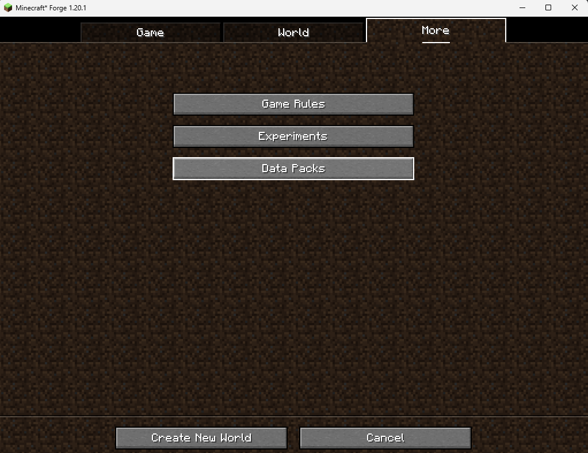
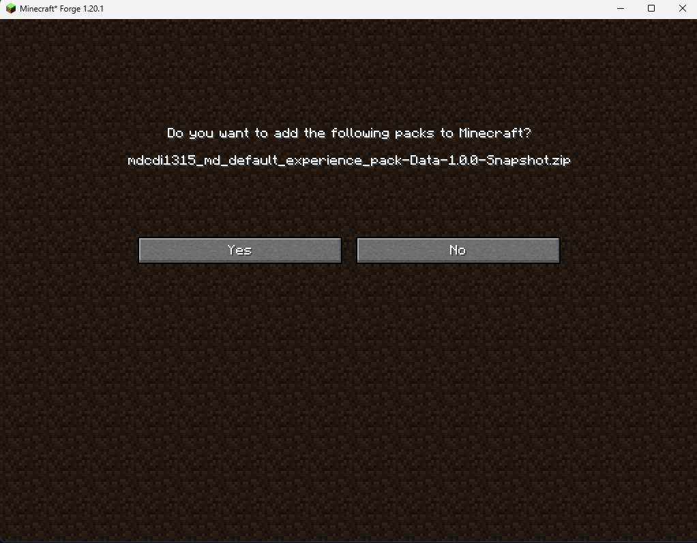
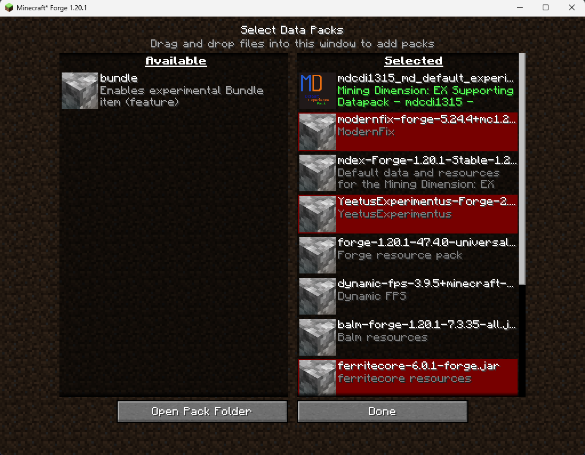
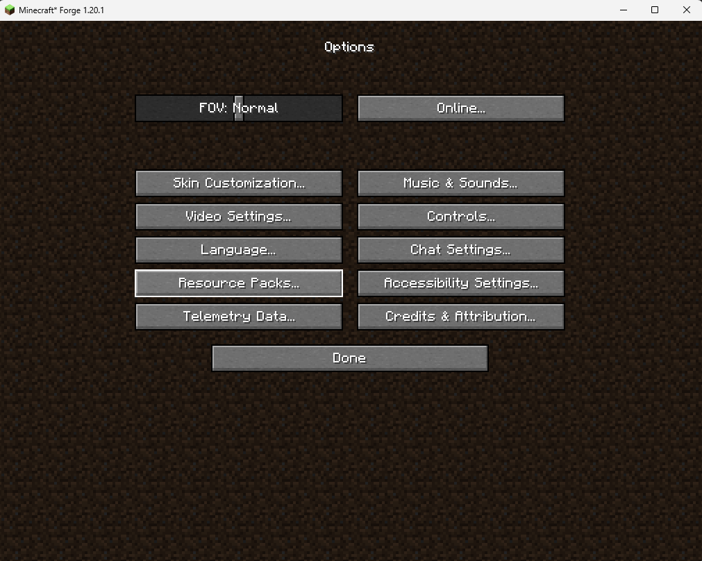

## Welcome to the Default Mining Dimension: EX experience pack!

This repository provides the data for creating the default experience pack for the [Mining Dimension: EX](https://github.com/mdcdi1315/mdex) mod.

As stated above, that mod is required for this pack since it heavily uses the data pack features that provides.

Apart of these it has and a build script that allows to create quickly the data pack assets and data as zip files.

### How to inject it into Minecraft

First make sure that you have the [mod](https://github.com/mdcdi1315/mdex) installed to your modded instance.

Then, download this pack from the releases. You can download pack releases from this repo or from CurseForge.

Then, create a new world, and head here.

Press the `Data Packs` button, it will lead you to a list of datapacks selected for the new world. 

Drag-n-drop the data pack there.

You should see a message like the following.

Finally, add the pack to the `Selected` tab of the list view.

You have possibly reached here:

Done! press the `Done` button and you are good to go.

Installing the resource pack (Client side only):

The provided resource pack is also needed for providing 
the translations, correct advancement display and the music that currently accompanies the defined biomes.

A similar process is done for installing that pack, except that you install it through the 'Resource Packs' option in the 'Options...' menu.

Here is the button for reference:

Note, you do the exact same actions for installing the resource pack but remember to select instead the ZIP file that has the word 'Resources' in it's name.

